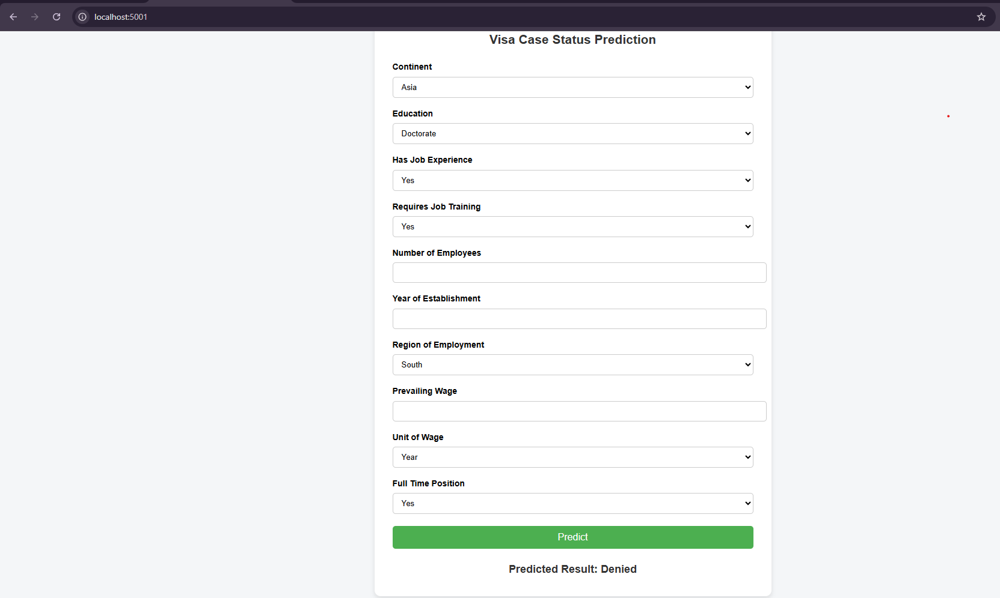

# visa-application
"We want to predict whether a visa application will be approved or denied based on historical application data to assist OFLC in faster and accurate decision-making."

1. conda create --prefix ./visa_venv python=3.10 -y
    conda activate ./visa_venv

2. Fetched data from MongoDB database
3. Configured DVC for datasets tracking
4. https://dagshub.com/srinu-nayak/visa-application/experiments#/experiment/m_f02b60227e7f41808bf43536ad13f42d
5. docker pull srinu0930/visa-application:latest
6. docker run -p 5001:5000 srinu0930/visa-application:latest
7. create ec2 instance and do sudo apt update && sudo apt install -y docker.io | sudo usermod -aG docker $USER
8. Ensure port 5000 is open in the EC2 Security Group inbound rules
9. http://<EC2_PUBLIC_IP>
